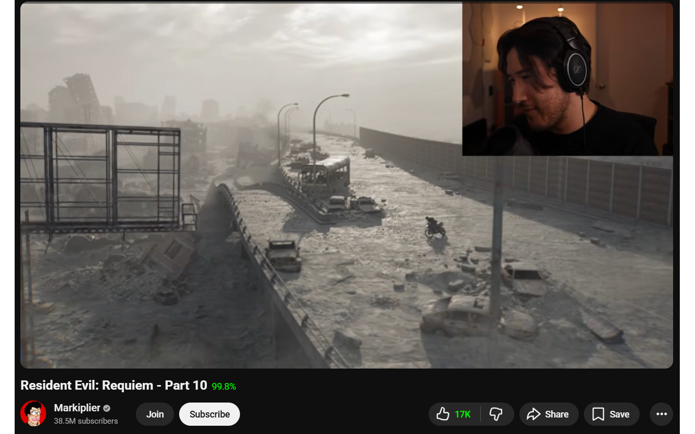
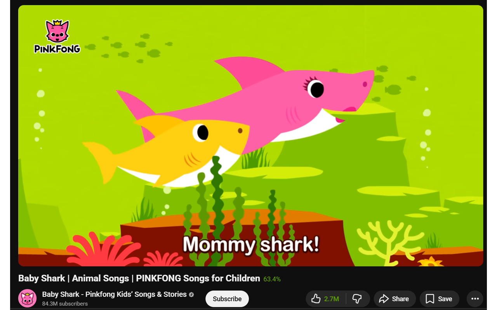
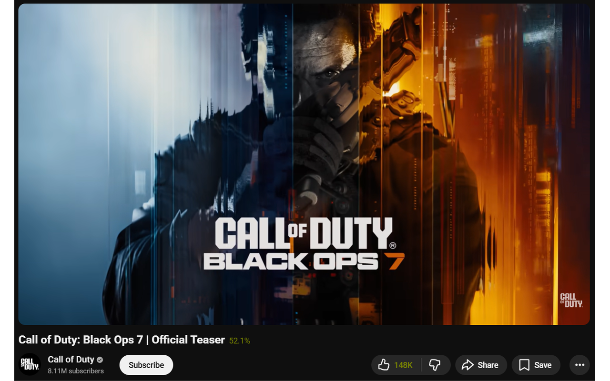
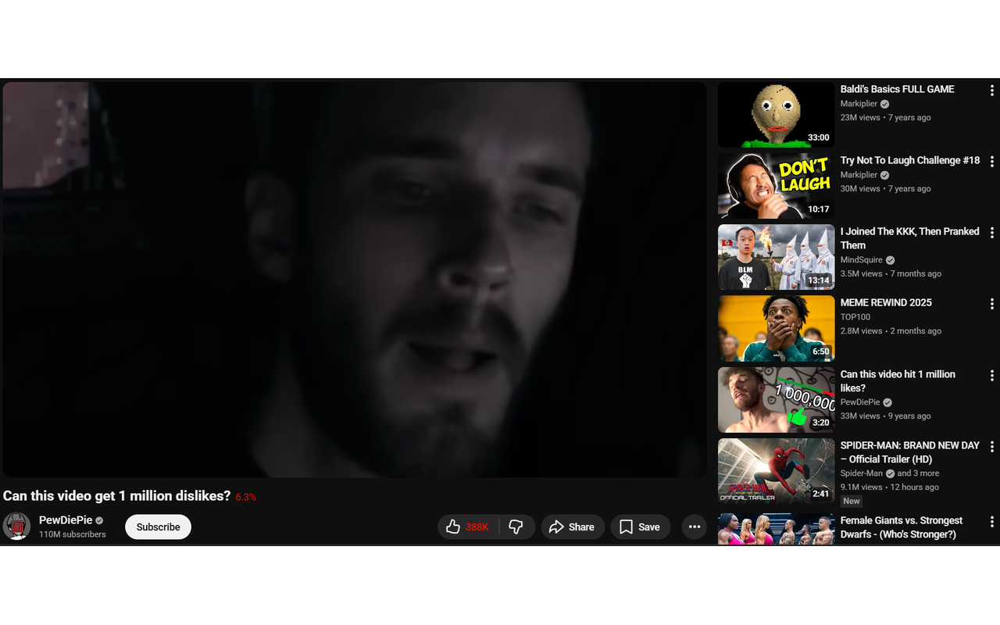
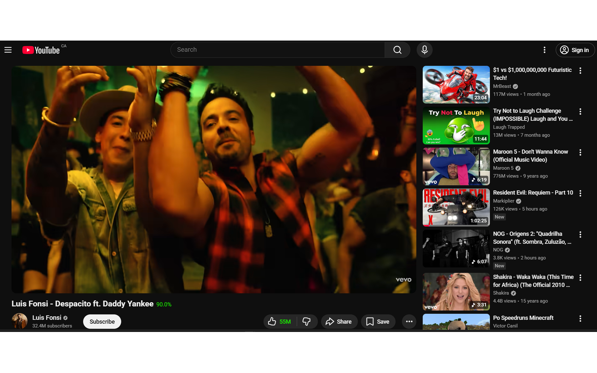
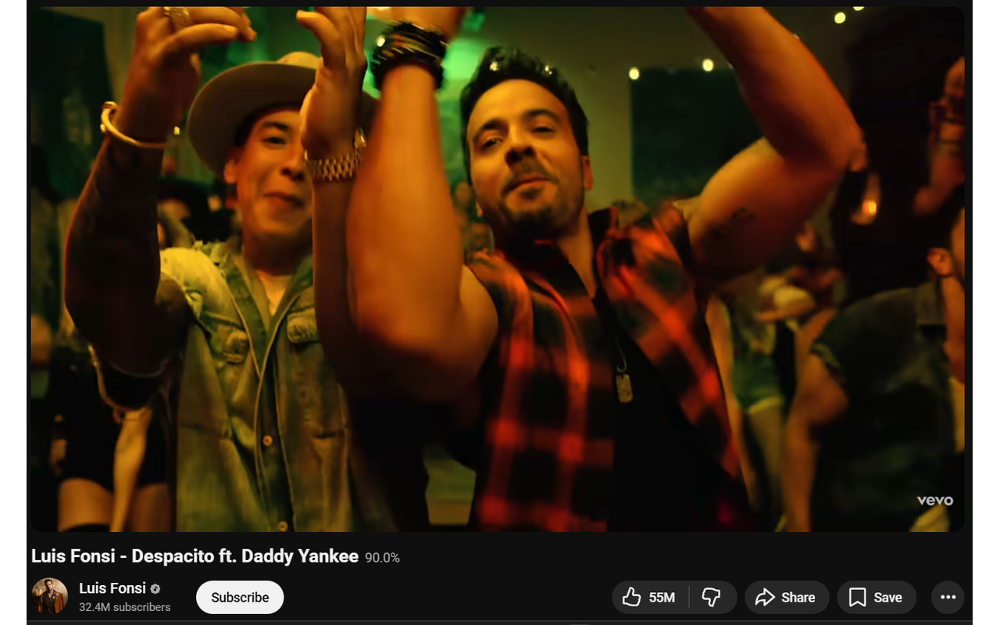

# YouTube Like %

A minimal Chrome extension that shows the **like percentage** next to the video title on YouTube watch pages, with optional like-count coloring.



## Features

- **Like percentage** (e.g. "99.8%") appears next to the video title via a CSS `::after` pseudo-element — no DOM injection, no layout shifts.
- **Color-coded like count** — optionally colors the like count text on a green-to-red gradient based on the ratio (toggle via the extension popup, off by default).
- **Color-coded percentage** — when coloring is enabled, the percentage text itself is also colored to match.
- Uses the [Return YouTube Dislike API](https://returnyoutubedislike.com/) — works with or without the RYD extension installed.

## Screenshots

| High ratio (99.8%) | Medium ratio (63.4%) |
|---|---|
|  |  |

| Mixed ratio (52.1%) | Low ratio (6.3%) |
|---|---|
|  |  |

| Color on (90.0%) | Color off (90.0%) |
|---|---|
|  |  |

## Install

1. Clone or download this repo.
2. Open Chrome and go to `chrome://extensions`.
3. Turn on **Developer mode** (top-right toggle).
4. Click **Load unpacked** and select this folder.
5. Open any YouTube video — the percentage will appear after the title.

## Usage

- Click the extension icon in the toolbar to open the popup.
- Toggle **Color like count** to enable/disable coloring the like button text and percentage on a green (high ratio) to red (low ratio) gradient. Off by default.
- The percentage next to the title is always shown regardless of the color setting.

## How it works

1. On `/watch` pages, the content script calls the [Return YouTube Dislike API](https://returnyoutubedislikeapi.com/) with the current video ID.
2. It computes `likes / (likes + dislikes) * 100` and injects a single `<style>` tag that:
   - Appends the percentage after the video title using a `::after` pseudo-element.
   - Optionally colors the like count text green-to-red (when enabled in settings).
3. API calls use retry with exponential backoff (up to 2 retries), rate limiting (1 s minimum gap), and 429 back-off (30 s).
4. A `MutationObserver` re-applies styles when YouTube re-renders, and a URL poll detects SPA navigation.
5. The color toggle state is persisted via `chrome.storage.sync`.

## Tests

```bash
npm install
npm test
```

Runs [Vitest](https://vitest.dev/) tests covering the pure functions in `lib.js`:

- `getVideoId` — URL parsing for watch pages
- `likeColor` — green-to-red color gradient calculation
- `calcPercent` — like/dislike percentage with edge cases
- `buildCSS` — CSS generation with color toggle
- `getRetryDelay` — exponential backoff timing

## Limitations

- The RYD public API does not have accurate data for every video. For some older or high-profile videos, the API may return zero likes; in those cases the extension shows a gray **?%** next to the title instead of a percentage. The same **?%** appears if the API is down or unreachable.
- The RYD browser extension uses additional internal data sources that this simple API call does not have access to, so counts may differ slightly.

## Files

| File | Description |
|------|-------------|
| `manifest.json` | Chrome extension manifest (Manifest V3) |
| `lib.js` | Pure functions: URL parsing, color math, CSS generation, retry delays |
| `content.js` | Content script: fetches votes, injects CSS, handles storage and observers |
| `popup.html` | Extension popup UI with color toggle |
| `popup.js` | Popup logic: reads/writes `colorEnabled` to `chrome.storage.sync` |
| `tests/lib.test.js` | Vitest test suite for `lib.js` |

## Privacy policy

YouTube Like % does **not** collect, store, or transmit any personal data. The only data persisted is a single boolean preference (color toggle on/off) saved locally via `chrome.storage.sync`. The extension sends the current video ID to the [Return YouTube Dislike API](https://returnyoutubedislike.com/) solely to retrieve public like/dislike counts — no user-identifiable information is included in these requests.

## License

[MIT](LICENSE)
